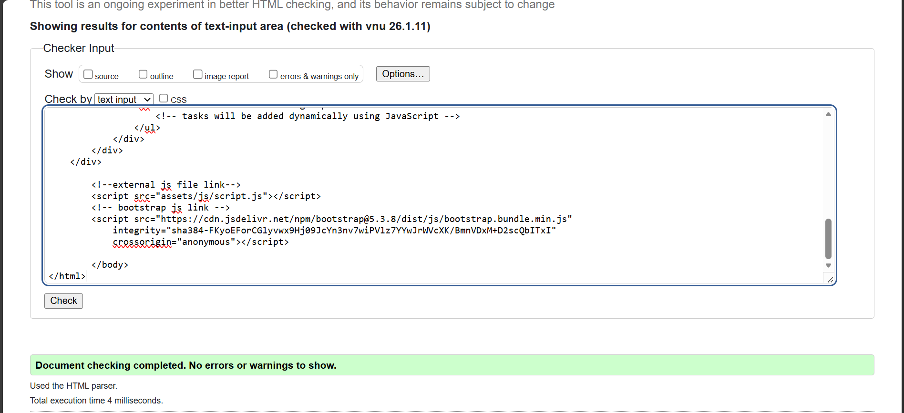
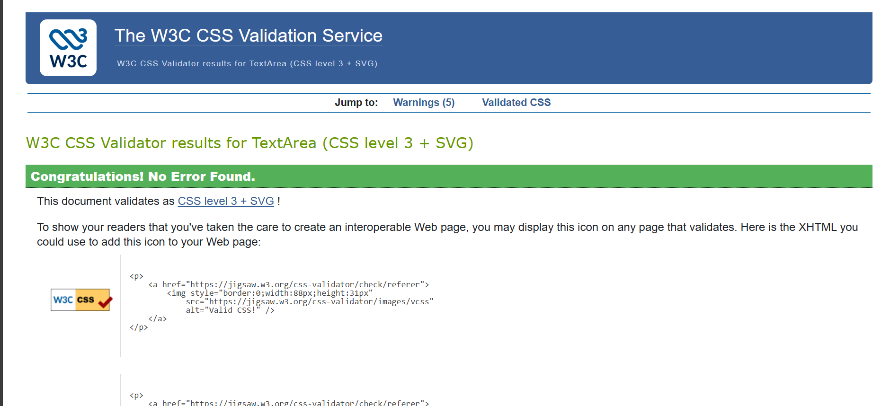
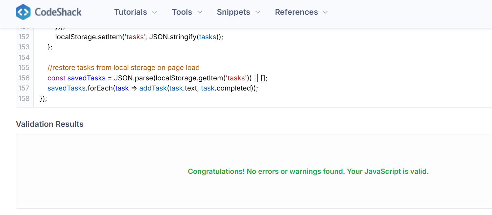
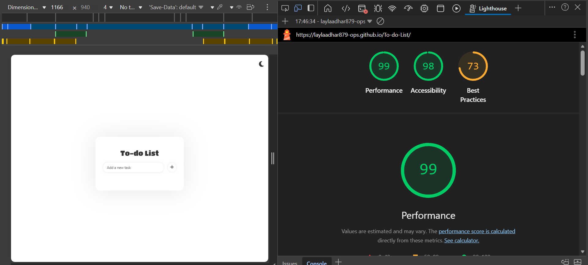

# To-do-List

https://laylaadhar879-ops.github.io/To-do-List/

A one page app that allows users to track, edit and delete their tasks.

## Current Pages

As soon as the user loads the webpage the to do list will appear and it will allow them to add as much tasks as they like, the user has the ability to check off what they have completed, delete what they don't need and edit anything they don't want or if a spelling mistake was made. All contents will still be available to the user if they refresh the page and it would appear just how they left it. 

Within this project, I compiled the code through the following files:  *index.html*, *style.css* and *script.js*

## Features

**Adding Tasks**
The form input element within the html file allows you to type and submit text. This is followed by an add icon. within the JavaScript file. I have included event listeners to insert a list item of whatever the user has input when either the enter key is pressed or if the add icon is clicked.  

**Deleting Taks**
Extracting the trash icon from font Awesome and giving it a funtion to remove the list item when it is clicked.

**Editing Tasks**
Editing function allows users to edit the list item and save change by either a click or pressing the enter key, even when the page is refreshed the content that was edited is stored in local storage allowing you to still have access.(AI assisted in completeing the function).

**Bootstrap**
Using the bootstrap grid i was able to proprly align the content. I implimented the link in the head and body of the html file.

**google Fonts**
I imported my chosen fonts from google fonts and inserted it into my css file.

For the H1 i chose to use 'Titan One, cursive' To make the title stand out an easy to read as that was the main contents of the page. 

For all the other text i selcted 'Rubik, sans Serif'. This again is easy to read and is a contrast of the other font used this allows the text to be visable without taking too much from the heading.

All fonts are still visible and easy to read when the theme is changed to dark mode.

**Icons**

All icons I used in the page was imported from Font Awesome and the link is embedded in the head of the html file. 

**Images**
I used an image for the background, i found an image from freepik and applied it as the backgground.

image URL : https://img.freepik.com/premium-photo/pastel-watercolor-brush-stroke-clipart-background_303085-18696.jpg

## AI

I was able to prompt AI to manipulate it and use it in order to help me achieve my current outcome:

To generate user stories with acceptance citerias and tasks i prompted the following, " I am working on a To-do list app for a project. i am using Html for static structure, Css for styling and Javascript for responsivity. I want the user to be able to be able to add tasks, delete it, edit them and check it off. The user should be able to decide if they want to view the page in dark or light mode. With this information, could you generate user stories with acceptance criterias and tasks in order for me to acheive this."

I was having issues with the edit button and its functions as it was allowing me to edit it but not save the input the user had changed it to. With the help of AI i prompted the following and recieved this solution " When the user tries to edit the list item and submit the chanege it isn,t saving to changes. could you help me fix my code so that when the user edits the listitem and clicks the check the input saves even when the page is refreshed." solution code lines 66 - 120 in Script.js file.

## Validations 

